# 相机标定笔记

本文按单目标定、双目标定和双目计算的顺序，整理成像模型、关键步骤及对应的 C++ 实现。文中的 OpenCV 与自行实现代码用于对照阅读。

## 目录

- [单目标定（基于张氏标定）](#monocular)
  - [成像模型](#mono-model)
  - [提取标定板特征点](#mono-corners)
  - [单目相机标定](#mono-calibration)
- [双目相机标定](#stereo)
  - [成像模型](#stereo-model)
  - [提取标定板特征点](#stereo-corners)
  - [双目相机标定](#stereo-calibration)
  - [双目计算](#stereo-computation)
- [参考资料](#references)
- [更新记录](#history)

<a id="monocular"></a>

## 单目标定（基于张氏标定）

<a id="mono-model"></a>

### 1. 成像模型

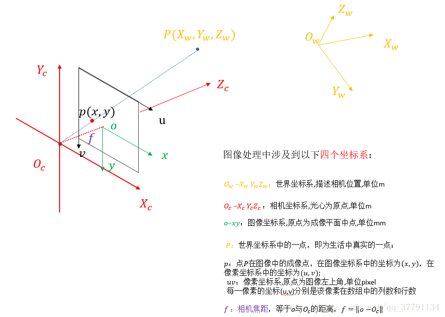

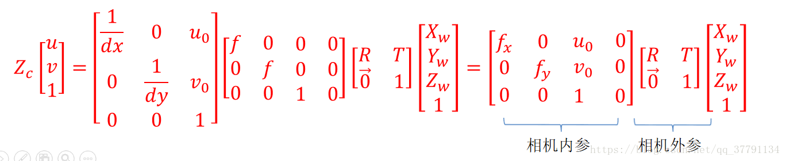

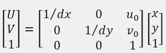

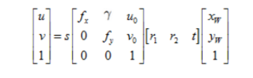

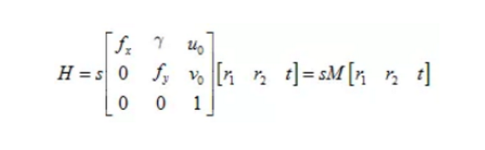

<a id="mono-corners"></a>

### 2. 提取标定板特征点

```cpp
std::vector<cv::Point2f> corners;
bool found = cv::findChessboardCorners(imgsLeft[i], boardSize, corners, cv::CALIB_CB_ADAPTIVE_THRESH | cv::CALIB_CB_NORMALIZE_IMAGE);
if (!found)
	continue;
cornerSubPix(imgsLeft[i], corners, cv::Size(11, 11), cv::Size(-1, -1), cv::TermCriteria(cv::TermCriteria::COUNT + cv::TermCriteria::EPS, 30, 0.01));
#ifdef _DEBUG
	cv::Mat imgColor;
	cvtColor(imgsLeft[i], imgColor, cv::COLOR_GRAY2BGR);
	drawChessboardCorners(imgColor, boardSize, corners, found);
#endif // _DEBUG
```

<a id="mono-calibration"></a>

### 3. 单目相机标定（CalibSingleCamera）

#### 主体代码

- **OpenCV**

```cpp
cv::Mat cameraMatrix, distCoeffs, R, T;
double rms = cv::calibrateCamera(objectPoints, imagePoints, imgSize, cameraMatrix, distCoeffs, R, T);
calibResult = { cameraMatrix, distCoeffs, R, T };
```

- **自行实现**

```cpp
/*单应矩阵H 以及矩阵V*/
std::vector<cv::Mat> H_vec_;
CalcMatrixH(imagePoints, objectPoints, H_vec_);

cv::Mat V;
CalcMatrixV(H_vec_, V);

/* matA */
cv::Mat cameraMatrix;
CalcMatrixA(V, cameraMatrix);

/* matR matT */
std::vector<cv::Mat> R_vec_, T_vec_;
CalcMatrixRT(cameraMatrix, H_vec_, R_vec_, T_vec_);

/* 畸变 */
cv::Mat distCoeffs;
GetDistortcCoefInit(imagePoints, objectPoints, cameraMatrix, R_vec_, T_vec_, distCoeffs);

/* CalcRepjErr */
CalcReprojectError(imagePoints, objectPoints, cameraMatrix, distCoeffs, R_vec_, T_vec_);

/*优化*/
OptimizeParamsSingle(imagePoints, objectPoints, cameraMatrix, distCoeffs, R_vec_, T_vec_);

/* CalcRepjErr */
CalcReprojectError(imagePoints, objectPoints, cameraMatrix, distCoeffs, R_vec_, T_vec_);

/* 统一格式，对齐opencv */
cv::Mat R, T;
AlignFormatParams(distCoeffs, R_vec_, T_vec_, R, T);

calibResult = { cameraMatrix, distCoeffs, R, T };
```

- **自行实现（预设初始内参后使用 Ceres 优化）**

```cpp
if (calibResult.empty())
	return MT_INPUT_ERR;

cv::Mat cameraMatrix = calibResult[0];
cv::Mat distCoeffs = calibResult[1];

/* 以及矩阵V*/
std::vector<cv::Mat> R_vec_, T_vec_;
if (calibResult[2].empty() || calibResult[3].empty())//新计算
{
	std::vector<cv::Mat> H_vec_;
	CalcMatrixH(imagePoints, objectPoints, H_vec_);//单应矩阵H
	CalcMatrixRT(cameraMatrix, H_vec_, R_vec_, T_vec_);
}
else//已有值
{
	for (size_t i = 0; i < calibResult[2].rows; i++)
    {
        cv::Mat thisR = (cv::Mat_<double>(3, 1) << calibResult[2].ptr<cv::Vec3d>(i)[0][0], 	calibResult[2].ptr<cv::Vec3d>(i)[0][1], calibResult[2].ptr<cv::Vec3d>(i)[0][2]);
        cv::Mat thisT = (cv::Mat_<double>(3, 1) << calibResult[3].ptr<cv::Vec3d>(i)[0][0], 	calibResult[3].ptr<cv::Vec3d>(i)[0][1], calibResult[3].ptr<cv::Vec3d>(i)[0][2]);
        cv::Rodrigues(thisR, thisR);
        R_vec_.push_back(thisR);
        T_vec_.push_back(thisT);
    }
}

/*优化*/
OptimizeParamsSingle(imagePoints, objectPoints, cameraMatrix, distCoeffs, R_vec_, T_vec_);

/* CalcRepjErr */
CalcReprojectError(imagePoints, objectPoints, cameraMatrix, distCoeffs, R_vec_, T_vec_);

/* 统一格式，对齐opencv */
cv::Mat R, T;
AlignFormatParams(distCoeffs, R_vec_, T_vec_, R, T);

calibResult = { cameraMatrix, distCoeffs, R, T };
```

#### 子代码函数

##### 1. 单应矩阵H（CalcMatrixH）

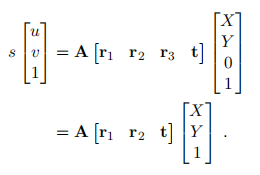

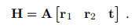

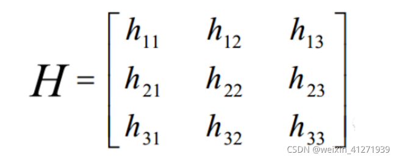

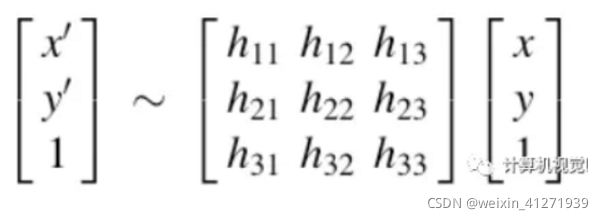

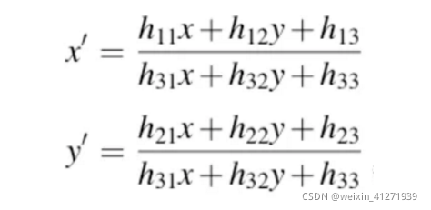

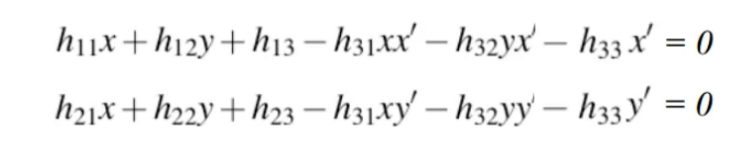

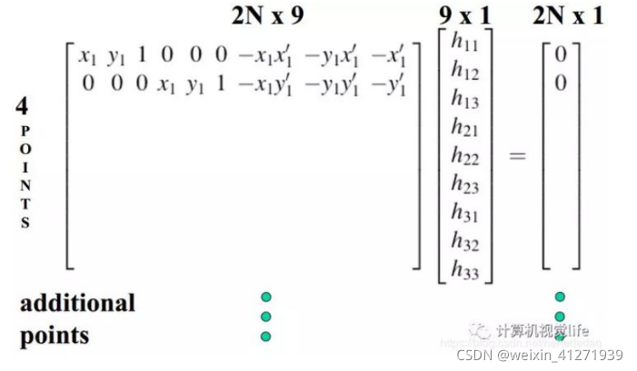

- **OpenCV**

```cpp
cv::findHomography(objectPoints[i], imagePoints[i]);
```

- **自行实现**

```cpp
cv::Mat A = cv::Mat::zeros(imagePoints[i].size() * 2, 9, CV_64FC1);
for (size_t j = 0; j < imagePoints[i].size(); j++)
{
    cv::Point2f p_2d = imagePoints[i][j];
    cv::Point3f p_3d = objectPoints[i][j];
    A.at<double>(2 * j, 0) = p_3d.x;
    A.at<double>(2 * j, 1) = p_3d.y;
    A.at<double>(2 * j, 2) = 1;
    A.at<double>(2 * j, 3) = 0;
    A.at<double>(2 * j, 4) = 0;
    A.at<double>(2 * j, 5) = 0;
    A.at<double>(2 * j, 6) = -p_2d.x * p_3d.x;
    A.at<double>(2 * j, 7) = -p_2d.x * p_3d.y;
    A.at<double>(2 * j, 8) = -p_2d.x;

    A.at<double>(2 * j + 1, 0) = 0;
    A.at<double>(2 * j + 1, 1) = 0;
    A.at<double>(2 * j + 1, 2) = 0;
    A.at<double>(2 * j + 1, 3) = p_3d.x;
    A.at<double>(2 * j + 1, 4) = p_3d.y;
    A.at<double>(2 * j + 1, 5) = 1;
    A.at<double>(2 * j + 1, 6) = -p_2d.y * p_3d.x;
    A.at<double>(2 * j + 1, 7) = -p_2d.y * p_3d.y;
    A.at<double>(2 * j + 1, 8) = -p_2d.y;
}
cv::Mat U, W, VT;                                                    // A =UWV^T
cv::SVD::compute(A, W, U, VT, cv::SVD::MODIFY_A | cv::SVD::FULL_UV); // Eigen 返回的是V,列向量就是特征向量, opencv 返回的是VT，所以行向量是特征向量

thisH = VT.row(8).reshape(0, 3);
thisH /= thisH.ptr<double>(2)[2];
```

##### 2. 计算矩阵V（CalcMatrixV）

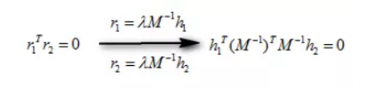

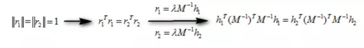

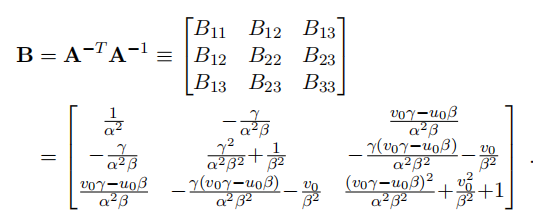

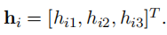

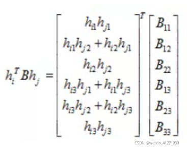

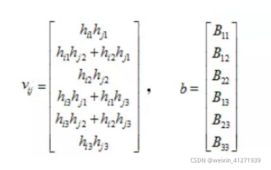

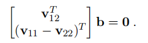

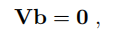

```cpp
int CalcMatrixV(const std::vector<cv::Mat>& H_vec_, cv::Mat& V)
{
    if (H_vec_.empty())
        return MT_INPUT_ERR;

    V = cv::Mat::zeros(H_vec_.size() * 2, 6, CV_64FC1);
    for (size_t i = 0; i < H_vec_.size(); i++)
    {
        cv::Mat thisH = H_vec_[i];
        /* h1 h2 */
        double h11 = thisH.at<double>(0, 0);
        double h21 = thisH.at<double>(1, 0);
        double h31 = thisH.at<double>(2, 0);
        double h12 = thisH.at<double>(0, 1);
        double h22 = thisH.at<double>(1, 1);
        double h32 = thisH.at<double>(2, 1);

        /* v12 v11 v22 */
        cv::Mat v11 = (cv::Mat_<double>(1, 6) << h11 * h11, h11 * h21 + h11 * h21, h21 * h21, h11 * h31 + h31 * h11, h21 * h31 + h31 * h21 + h31 * h31, h31 * h31);
        cv::Mat v12 = (cv::Mat_<double>(1, 6) << h11 * h12, h11 * h22 + h21 * h12, h21 * h22, h11 * h32 + h31 * h12, h21 * h32 + h31 * h22 + h31 * h32, h31 * h32);
        cv::Mat v22 = (cv::Mat_<double>(1, 6) << h12 * h12, h12 * h22 + h12 * h22, h22 * h22, h12 * h32 + h32 * h12, h22 * h32 + h32 * h22 + h32 * h32, h32 * h32);

        /* V */

        v12.copyTo(V.row(i * 2 + 0));
        cv::Mat temp = v11 - v22;
        temp.copyTo(V.row(i * 2 + 1));
    }
    return MT_OK;
}

```

##### 3. 计算相机内参（CalcMatrixA）

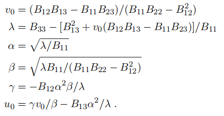

```cpp
int CalcMatrixA(const cv::Mat& V, cv::Mat& matA)
{
    if (V.empty())
        return MT_INPUT_ERR;
    cv::Mat w, u, vt;
    cv::SVD::compute(V, w, u, vt);
    cv::Mat b = vt.row(5).clone();

    double B11 = b.at<double>(0, 0);
    double B12 = b.at<double>(0, 1);
    double B22 = b.at<double>(0, 2);
    double B13 = b.at<double>(0, 3);
    double B23 = b.at<double>(0, 4);
    double B33 = b.at<double>(0, 5);

    double v0 = (B12 * B13 - B11 * B23) / (B11 * B22 - B12 * B12);
    double lambda = B33 - (B13 * B13 + v0 * (B12 * B13 - B11 * B23)) / B11;
    double alpha = sqrt(lambda / B11);
    double beta = sqrt(lambda * B11 / (B11 * B22 - B12 * B12));
    double sigma = 0;// -1.0 * B12 * alpha * alpha * beta / lambda;
    double u0 = sigma * v0 / alpha - B13 * alpha*alpha / lambda;
    matA = (cv::Mat_<double>(3, 3) <<
            alpha, sigma, u0,
            0, beta, v0,
            0, 0, 1);
    //std::cout << "matA:\n" << matA << std::endl;
    return MT_OK;
}

```

##### 4. 计算旋转平移矩阵（CalcMatrixRT）

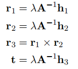

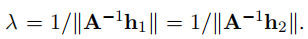

```cpp
int CalcMatrixRT(const cv::Mat& matA, const std::vector<cv::Mat>& H_vec_,
                 std::vector<cv::Mat>& R_vec_, std::vector<cv::Mat>& T_vec_)
{
    if (matA.empty() || H_vec_.empty())
        return MT_INPUT_ERR;
    for (size_t i = 0; i < H_vec_.size(); i++)
    {
        cv::Mat tempMat1 = matA.inv()*H_vec_[i].col(0);
        cv::Mat tempMat2 = matA.inv()*H_vec_[i].col(1);
        double k1 = 1 / (cv::norm(tempMat1));
        double k2 = 1 / (cv::norm(tempMat2));
        double k = (k1 + k2) / 2.0;
        cv::Mat r1 = k * matA.inv()*H_vec_[i].col(0);
        cv::Mat r2 = k * matA.inv()*H_vec_[i].col(1);
        cv::Mat r3 = r1.cross(r2);
        cv::Mat t = k * matA.inv()*H_vec_[i].col(2);

        cv::Mat r = cv::Mat::zeros(3, 3, CV_64FC1);
        r1.copyTo(r.col(0));
        r2.copyTo(r.col(1));
        r3.copyTo(r.col(2));
        std::vector<double> rr;
        cv::Rodrigues(r, rr);

        R_vec_.push_back(r);
        T_vec_.push_back(t);
    }
    return MT_OK;
}

```

5.计算畸变参数初始值（GetDistortcCoefInit）

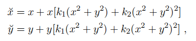

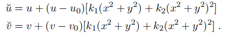

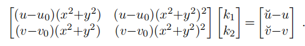

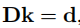

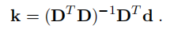

```cpp
int GetDistortcCoefInit(const std::vector<std::vector<cv::Point2f>>& imagePoints, const std::vector<std::vector<cv::Point3f>>& objectPoints,
                        const cv::Mat& matA, const std::vector<cv::Mat>& R_vec_, const std::vector<cv::Mat>& T_vec_,
                        cv::Mat& distortCoef)
{
    /*
		x'= u'- u0,	x = u - u0
		y'= v'- v0,	y = v - v0
		径向畸变
		x'= x(1 + k1*r^2 + k2*r^4 + k3*r^6) => u'- u0 = (u-u0)(1 + k1*r^2 + k2*r^4 + k3*r^6) => u'- u = (u-u0)(k1*r^2 + k2*r^4 + k3*r^6)
		y'= y(1 + k1*r^2 + k2*r^4 + k3*r^6) => v'- v0 = (v-v0)(1 + k1*r^2 + k2*r^4 + k3*r^6) => v'- v = (v-v0)(k1*r^2 + k2*r^4 + k3*r^6)
			=>
		(u-u0)*r^2	(u-u0)*r^4	(u-u0)*r^6		k1		u'- u
		(v-v0)*r^2	(v-v0)*r^4	(v-v0)*r^6	*	k2	=	v'- v
												k3
		切向畸变
		x'= x + [2 * p1 * xy + p2 * (r^2 + 2 * x^2)]
		y'= y + [p1 * (r^2 + 2 * y^2) + 2 * p2 * xy]
			=>
		2(u - u0)(v - v0)		r^2 + 2 * (u - u0)^2	*	p1	=	u'- u
		r^2 + 2 * (v - v0)^2	2(u - u0)(v - v0)			p2		v'- v

		*/
    if (imagePoints.empty() || objectPoints.empty())
        return MT_INPUT_ERR;

    std::vector<double> r2_vec;
    std::vector<std::vector<cv::Point2f>> ideal_point_vec;
    ideal_point_vec.resize(objectPoints.size());
    for (size_t i = 0; i < objectPoints.size(); i++)
    {
        for (size_t j = 0; j < objectPoints[i].size(); j++)
        {
            cv::Mat p_3d = (cv::Mat_<double>(3, 1) << objectPoints[i][j].x, objectPoints[i][j].y, 0);
            cv::Mat p_pic = R_vec_[i] * p_3d + T_vec_[i];
            p_pic /= p_pic.at<double>(2, 0);
            double x = p_pic.at<double>(0, 0);
            double y = p_pic.at<double>(1, 0);
            double r2 = x * x + y * y;
            r2_vec.push_back(r2);
            cv::Mat p_uv = matA * p_pic;
            ideal_point_vec[i].push_back(cv::Point2f(p_uv.at<double>(0, 0), p_uv.at<double>(1, 0)));
        }
    }

    double u0 = matA.at<double>(0, 2);
    double v0 = matA.at<double>(1, 2);
    cv::Mat D = cv::Mat::zeros(ideal_point_vec.size() * 2, 5, CV_64F);
    cv::Mat d = cv::Mat::zeros(ideal_point_vec.size() * 2, 1, CV_64F);
    for (size_t i = 0; i < ideal_point_vec.size(); i++)
    {
        for (size_t j = 0; j < ideal_point_vec[i].size(); j++)
        {
            double r2 = r2_vec[i];
            cv::Point2f distort_p = imagePoints[i][j];
            cv::Point2f ideal_p = ideal_point_vec[i][j];
            D.at<double>(2 * i, 0) = (ideal_p.x - u0) * r2;//k1
            D.at<double>(2 * i, 1) = (ideal_p.x - u0) * r2 * r2;//k2
            D.at<double>(2 * i, 2) = 2.0*(ideal_p.x - u0)*(ideal_p.y - v0);//p1
            D.at<double>(2 * i, 3) = r2 + 2 * (ideal_p.x - u0) * (ideal_p.x - u0);//p2
            D.at<double>(2 * i, 4) = (ideal_p.x - u0) * r2 * r2 * r2;//k3

            D.at<double>(2 * i + 1, 0) = (ideal_p.y - v0) * r2;//k1
            D.at<double>(2 * i + 1, 1) = (ideal_p.y - v0) * r2 * r2;//k2
            D.at<double>(2 * i + 1, 2) = r2 + 2 * (ideal_p.y - v0) * (ideal_p.y - v0);//p1
            D.at<double>(2 * i + 1, 3) = 2.0*(ideal_p.x - u0)*(ideal_p.y - v0);//p2
            D.at<double>(2 * i + 1, 4) = (ideal_p.y - v0) * r2 * r2 * r2;//k3

            d.at<double>(0, 0) = distort_p.x - ideal_p.x;
            d.at<double>(1, 0) = distort_p.y - ideal_p.y;
        }
    }
    distortCoef = (D.t()*D).inv(cv::DECOMP_SVD) * D.t() * d;
    return MT_OK;
}
```

##### 5. 基于 Ceres 优化重投影误差（OptimizeParamsSingle）

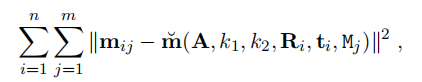

```cpp
int OptimizeParamsSingle(const std::vector<std::vector<cv::Point2f>>& imagePoints, const std::vector<std::vector<cv::Point3f>>& objectPoints, cv::Mat& matA, cv::Mat& distortCoef, std::vector<cv::Mat>& R_vec_, std::vector<cv::Mat>& T_vec_)
{
    if (imagePoints.empty() || objectPoints.empty())
        return MT_INPUT_ERR;

    ceres::Problem problem;
    int pic_num = objectPoints.size();
    double *matA_para = new double[4];
    *(matA_para + 0) = matA.at<double>(0, 0);
    *(matA_para + 1) = matA.at<double>(1, 1);
    *(matA_para + 2) = matA.at<double>(0, 2);
    *(matA_para + 3) = matA.at<double>(1, 2);
    double *coeff_para = new double[5];
    *(coeff_para + 0) = distortCoef.at<double>(0, 0);
    *(coeff_para + 1) = distortCoef.at<double>(1, 0);
    *(coeff_para + 2) = distortCoef.at<double>(2, 0);
    *(coeff_para + 3) = distortCoef.at<double>(3, 0);
    *(coeff_para + 4) = distortCoef.at<double>(4, 0);
    double *cam_para = new double[6 * pic_num];
    for (size_t i = 0; i < pic_num; i++)
    {
        cv::Mat angle_axis;
        cv::Rodrigues(R_vec_[i], angle_axis);

        *(cam_para + 6 * i + 0) = angle_axis.at<double>(0, 0);
        *(cam_para + 6 * i + 1) = angle_axis.at<double>(1, 0);
        *(cam_para + 6 * i + 2) = angle_axis.at<double>(2, 0);
        *(cam_para + 6 * i + 3) = T_vec_[i].at<double>(0, 0);
        *(cam_para + 6 * i + 4) = T_vec_[i].at<double>(1, 0);
        *(cam_para + 6 * i + 5) = T_vec_[i].at<double>(2, 0);
    }

    for (size_t i = 0; i < pic_num; i++)
    {
        for (size_t j = 0; j < objectPoints[i].size(); ++j)
        {
            double *cam_para_now = cam_para + 6 * i;
            ceres::CostFunction *cost_function =
                mtxCeres::ReprojErr::Create(imagePoints[i][j], objectPoints[i][j]);
            problem.AddResidualBlock(cost_function, nullptr, cam_para_now, matA_para, coeff_para);
        }
    }

    ceres::Solver::Options options;
    options.linear_solver_type = ceres::DENSE_SCHUR;
    options.minimizer_progress_to_stdout = true;
    ceres::Solver::Summary summary;
    ceres::Solve(options, &problem, &summary);
    //std::cout << "origin matA:\n" << matA << std::endl;
    //std::cout << "origin dist_coeff\n:" << distortCoef << std::endl;

    /* Result */
    matA.at<double>(0, 0) = *(matA_para + 0);
    matA.at<double>(1, 1) = *(matA_para + 1);
    matA.at<double>(0, 2) = *(matA_para + 2);
    matA.at<double>(1, 2) = *(matA_para + 3);
    distortCoef.at<double>(0, 0) = *(coeff_para + 0);
    distortCoef.at<double>(1, 0) = *(coeff_para + 1);
    distortCoef.at<double>(2, 0) = *(coeff_para + 2);
    distortCoef.at<double>(3, 0) = *(coeff_para + 3);
    distortCoef.at<double>(4, 0) = *(coeff_para + 4);
    //std::cout << "ceres optimize matA:\n" << matA << std::endl;
    //std::cout << "ceres optimize dist_coeff:\n" << distortCoef << std::endl;

    // update R_vec, t_vec
    for (size_t i = 0; i < R_vec_.size(); ++i)
    {
        double *T_para = cam_para + 6 * i;
        cv::Mat R_rid = (cv::Mat_<double>(3, 1) << *(T_para + 0), *(T_para + 1), *(T_para + 2));
        cv::Mat opt_R;
        cv::Rodrigues(R_rid, opt_R);
        R_vec_[i] = opt_R;
        T_vec_[i].at<double>(0, 0) = *(T_para + 3);
        T_vec_[i].at<double>(1, 0) = *(T_para + 4);
        T_vec_[i].at<double>(2, 0) = *(T_para + 5);
    }
    return MT_OK;
}
```

```cpp
/*重投影误差 优化内参 畸变*/
struct ReprojErr
{
    public:
    ReprojErr(const cv::Point2f &observe_p_2d_, const cv::Point3f &world_p_3d_)
        : observe_p_2d(observe_p_2d_), world_p_3d(world_p_3d_) {}
    template <typename T>
    bool operator()(const T *const camera, const T *const K, const T *const dist_coeff, T *residual) const
    {
        //! camera传入的并不是6*1的矩阵，只是取前面6个元素
        //  camera[0,1,2] are the angle-axis rotation.
        T p_3d[3] = { static_cast<T>(world_p_3d.x), static_cast<T>(world_p_3d.y), static_cast<T>(0) };
        T p[3];
        ceres::AngleAxisRotatePoint(camera, p_3d, p);
        // camera[3,4,5] are the translation.
        p[0] += camera[3];
        p[1] += camera[4];
        p[2] += camera[5];
        // Compute the center of distortion. The sign change comes from
        // the camera model that Noah Snavely's Bundler assumes, whereby
        // the camera coordinate system has a negative z axis.
        T x = p[0] / p[2];
        T y = p[1] / p[2];
        T r2 = x * x + y * y;

        const T &alpha = K[0];
        const T &beta = K[1];
        const T &u0 = K[2];
        const T &v0 = K[3];

        const T &k1 = dist_coeff[0];
        const T &k2 = dist_coeff[1];
        const T &p1 = dist_coeff[2];
        const T &p2 = dist_coeff[3];
        const T &k3 = dist_coeff[4];

        T x_dist = x * (static_cast<T>(1) + k1 * r2 + k2 * r2 * r2 + k3 * r2 * r2 * r2)
            + (2.0 * p1 * x * y + p2 * (r2 + 2.0*x*x));
        T y_dist = y * (static_cast<T>(1) + k1 * r2 + k2 * r2 * r2 + k3 * r2 * r2 * r2)
            + (p1*(r2 + 2.0*y*y) + 2.0 * p2 * x * y);

        const T u_dist = alpha * x_dist + u0;
        const T v_dist = beta * y_dist + v0;

        residual[0] = u_dist - static_cast<T>(observe_p_2d.x);
        residual[1] = v_dist - static_cast<T>(observe_p_2d.y);
        return true;
    }
    // 工厂函数，避免重复创建和析构实例
    static ceres::CostFunction *Create(const cv::Point2f &observe_p_2d_, const cv::Point3f &world_p_3d_)
    {
        return new ceres::AutoDiffCostFunction<ReprojErr, 2, 6, 4, 5>(new ReprojErr(observe_p_2d_, world_p_3d_));
    }

    private:
    const cv::Point2f observe_p_2d;
    const cv::Point3f world_p_3d;
};
```

<a id="stereo"></a>

## 双目相机标定

<a id="stereo-model"></a>

### 1. 成像模型

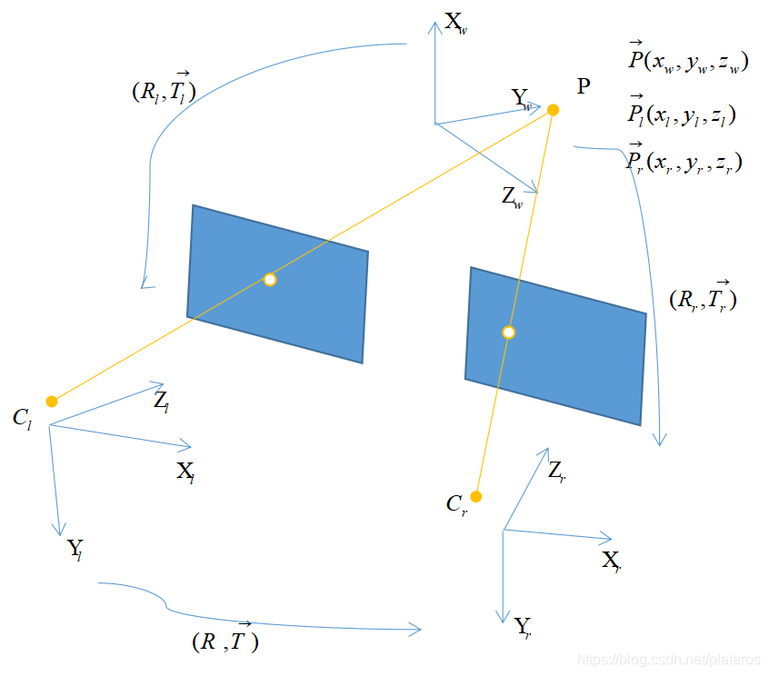

<a id="stereo-corners"></a>

### 2. 提取标定板特征点

左右图像中的棋盘格角点需与同一组标定板三维点对应，作为后续双目标定的输入。

<a id="stereo-calibration"></a>

### 3. 双目相机标定（CalibStereoCamera）

#### 主体代码

```cpp
int CalibStereoCamera(const std::vector<std::vector<cv::Point2f>>& imagePoints1, const std::vector<std::vector<cv::Point2f>>& imagePoints2, const std::vector<std::vector<cv::Point3f>>& objectPoints,
                      const cv::Size& imgSize, const MxtCalibMethod& method,
                      MxtStereoMatrix& calibResult)
```

- **OpenCV**

```cpp
cv::Mat cameraMatrix[2], distCoeffs[2];
cameraMatrix[0] = cv::initCameraMatrix2D(objectPoints, imagePoints1, imgSize, 0);
cameraMatrix[1] = cv::initCameraMatrix2D(objectPoints, imagePoints2, imgSize, 0);
cv::Mat R, T, E, F;
double rms = cv::stereoCalibrate(objectPoints, imagePoints1, imagePoints2,
                                 cameraMatrix[0], distCoeffs[0],
                                 cameraMatrix[1], distCoeffs[1],
                                 imgSize, R, T, E, F,
                                 cv::CALIB_USE_INTRINSIC_GUESS,
                                 cv::TermCriteria(cv::TermCriteria::COUNT + cv::TermCriteria::EPS, 100, 1e-5));
MXT_INFO_LOGGER << "StereoCalibrate RMS: " << rms;

/*极线矫正*/
cv::Rect validROIL, validROIR;//图像校正之后，会对图像进行裁剪，这里的validROI就是指裁剪之后的区域
cv::stereoRectify(cameraMatrix[0], distCoeffs[0], cameraMatrix[1], distCoeffs[1], imgSize, R, T,
                  calibResult.R1, calibResult.R2, calibResult.P1, calibResult.P2, calibResult.Q,
                  cv::CALIB_ZERO_DISPARITY, -1, imgSize, &validROIL, &validROIR);

cv::initUndistortRectifyMap(cameraMatrix[0], distCoeffs[0], calibResult.R1, calibResult.P1, imgSize, CV_32FC1, calibResult.map1x, calibResult.map1y);
cv::initUndistortRectifyMap(cameraMatrix[1], distCoeffs[1], calibResult.R2, calibResult.P2, imgSize, CV_32FC1, calibResult.map2x, calibResult.map2y);
```

- **自行实现**

```cpp
MxtCameraMatrix calibResultInit[2];
MxtInitCameraMatrix2D(objectPoints, imagePoints1, imgSize, calibResultInit[0]);
MxtInitCameraMatrix2D(objectPoints, imagePoints2, imgSize, calibResultInit[1]);

/*3*3矩阵转3*1向量*/
for (size_t i = 0; i < calibResultInit[0].R.size(); i++)
{
    cv::Rodrigues(calibResultInit[0].R[i], calibResultInit[0].R[i]);
    cv::Rodrigues(calibResultInit[1].R[i], calibResultInit[1].R[i]);
}

/*RT 初值*/
cv::Mat R, T, E, F;
GetMatrixRTInit(calibResultInit[0], calibResultInit[1], R, T);

/*优化*/
OptimizeParamsStereo(imagePoints1, imagePoints2, objectPoints, calibResultInit[0], calibResultInit[1], R, T, E, F);

/*极线矫正*/
MxtStereoRectify(calibResultInit[0].IntrinsicMatrix, calibResultInit[0].Distortion, calibResultInit[1].IntrinsicMatrix, calibResultInit[1].Distortion, imgSize, R, T,
                 calibResult.R1, calibResult.R2, calibResult.P1, calibResult.P2, calibResult.Q);

MxtInitUndistortRectifyMap(calibResultInit[0].IntrinsicMatrix, calibResultInit[0].Distortion, calibResult.R1, calibResult.P1, imgSize, calibResult.map1x, calibResult.map1y);
MxtInitUndistortRectifyMap(calibResultInit[1].IntrinsicMatrix, calibResultInit[1].Distortion, calibResult.R2, calibResult.P2, imgSize, calibResult.map2x, calibResult.map2y);
```

#### 子代码函数

##### 1. 初始化相机内外参（MxtInitCameraMatrix2D）

```cpp
int MxtInitCameraMatrix2D(const std::vector<std::vector<cv::Point3f>>& objectPoints, const std::vector<std::vector<cv::Point2f>>& imagePoints, const cv::Size& imageSize,
                          MxtCameraMatrix& calibResult)
{
    /*单应矩阵H 以及矩阵V*/
    std::vector<cv::Mat> H_vec_;
    CalcMatrixH(imagePoints, objectPoints, H_vec_);

    cv::Mat V;
    CalcMatrixV(H_vec_, V);

    /* matA */
    CalcMatrixA(V, calibResult.IntrinsicMatrix);

    /* matR matT */
    CalcMatrixRT(calibResult.IntrinsicMatrix, H_vec_, calibResult.R, calibResult.T);

    /*畸变为空*/
    calibResult.Distortion = cv::Mat::zeros(5, 1, CV_64FC1);
    return MT_OK;
}
```

##### 2. 双目标定RT矩阵初值（GetMatrixRTInit）

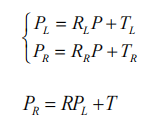

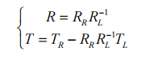

```cpp
int GetMatrixRTInit(const MxtCameraMatrix& calibParams1, const MxtCameraMatrix& calibParams2,
                    cv::Mat& R, cv::Mat& T)
{
    if (calibParams1.IntrinsicMatrix.empty() || calibParams2.IntrinsicMatrix.empty())
        return MT_INPUT_ERR;

    switch (0)
    {
        case 0://均值方法
            {
                R = cv::Mat::zeros(3, 3, CV_64FC1);
                T = cv::Mat::zeros(3, 1, CV_64FC1);
                for (size_t i = 0; i < calibParams1.R.size(); i++)
                {
                    /*R*/
                    cv::Mat thisR, thisT;
                    cv::Mat R1 = calibParams1.R[i];
                    cv::Rodrigues(R1, R1);
                    cv::Mat R2 = calibParams2.R[i];
                    cv::Rodrigues(R2, R2);
                    thisR = R2 * R1.inv();
                    /*T*/
                    cv::Mat T1 = calibParams1.T[i];
                    cv::Mat T2 = calibParams2.T[i];
                    thisT = T2 - thisR * T1;
                    /**/
                    R += thisR;
                    T += thisT;
                }
                R /= calibParams1.R.size();
                T /= calibParams2.R.size();
                break;
            }
        case 2://eigen
            {
                auto num_images = static_cast<int>(calibParams1.R.size());
                Eigen::MatrixXd mat_a = Eigen::MatrixXd::Zero(9 * num_images, 9);
                Eigen::MatrixXd mat_b = Eigen::MatrixXd::Zero(9 * num_images, 1);
                for (int i = 0; i < num_images; ++i) {
                    Eigen::Matrix3d r1_t, r2;
                    std::vector<double> temp1 = { calibParams1.R[i].ptr<double>(0)[0], calibParams1.R[i].ptr<double>(0)[1], calibParams1.R[i].ptr<double>(0)[2] };
                    std::vector<double> temp2 = { calibParams2.R[i].ptr<double>(0)[0], calibParams2.R[i].ptr<double>(0)[1], calibParams2.R[i].ptr<double>(0)[2] };
                    ceres::AngleAxisToRotationMatrix(temp1.data(), r1_t.data());
                    ceres::AngleAxisToRotationMatrix(temp2.data(), r2.data());
                    r1_t.transposeInPlace();
                    mat_a.block(9 * i, 0, 3, 3) = r1_t;
                    mat_a.block(9 * i + 3, 3, 3, 3) = r1_t;
                    mat_a.block(9 * i + 6, 6, 3, 3) = r1_t;
                    mat_b.block(9 * i, 0, 9, 1) << r2(0, 0), r2(0, 1), r2(0, 2),
                    r2(1, 0), r2(1, 1), r2(1, 2),
                    r2(2, 0), r2(2, 1), r2(2, 2);
                }
                Eigen::MatrixXd r = (mat_a.transpose() * mat_a).inverse() * mat_a.transpose() * mat_b;
                r.resize(3, 3);
                r.transposeInPlace();

                cv::eigen2cv(r, R);

                T = cv::Mat::zeros(3, 1, CV_64FC1);
                for (int i = 0; i < num_images; ++i) {
                    std::vector<double> temp1 = { calibParams1.T[i].ptr<double>(0)[0], calibParams1.T[i].ptr<double>(0)[1], calibParams1.T[i].ptr<double>(0)[2] };
                    std::vector<double> temp2 = { calibParams2.T[i].ptr<double>(0)[0], calibParams2.T[i].ptr<double>(0)[1], calibParams2.T[i].ptr<double>(0)[2] };
                    Eigen::Matrix<double, 3, 1> t, t1(temp1.data()), t2(temp2.data());
                    t = t2 - r * t1;
                    T.ptr<double>(0)[0] += t(0, 0);
                    T.ptr<double>(0)[1] += t(1, 0);
                    T.ptr<double>(0)[2] += t(2, 0);
                }
                T.ptr<double>(0)[0] /= num_images;
                T.ptr<double>(0)[1] /= num_images;
                T.ptr<double>(0)[2] /= num_images;
                break;
            }
        default:
            break;
    }

    return MT_OK;
}
```

##### 3. 基于 Ceres 优化重投影误差（OptimizeParamsStereo）

```cpp
int OptimizeParamsStereo(const std::vector<std::vector<cv::Point2f>>& imagePoints1, const std::vector<std::vector<cv::Point2f>>& imagePoints2,
                         const std::vector<std::vector<cv::Point3f>>& objectPoints,
                         MxtCameraMatrix& calibParams1, MxtCameraMatrix& calibParams2,
                         cv::Mat& R, cv::Mat& T, cv::Mat& E, cv::Mat& F)
{
    if (objectPoints.empty())
        return MT_INPUT_ERR;

    /*内参fx fy cx cy k1 k2 p1 p2 k3*/
    std::vector<double> IntrinsicMatrix1 = { calibParams1.IntrinsicMatrix.ptr<double>(0)[0],calibParams1.IntrinsicMatrix.ptr<double>(1)[1],
                                            calibParams1.IntrinsicMatrix.ptr<double>(0)[2],calibParams1.IntrinsicMatrix.ptr<double>(1)[2],
                                            calibParams1.Distortion.ptr<double>(0)[0],calibParams1.Distortion.ptr<double>(0)[1],calibParams1.Distortion.ptr<double>(0)[2],
                                            calibParams1.Distortion.ptr<double>(0)[3],calibParams1.Distortion.ptr<double>(0)[4] };
    std::vector<double> IntrinsicMatrix2 = { calibParams2.IntrinsicMatrix.ptr<double>(0)[0],calibParams2.IntrinsicMatrix.ptr<double>(1)[1],
                                            calibParams2.IntrinsicMatrix.ptr<double>(0)[2],calibParams2.IntrinsicMatrix.ptr<double>(1)[2],
                                            calibParams2.Distortion.ptr<double>(0)[0],calibParams2.Distortion.ptr<double>(0)[1],calibParams2.Distortion.ptr<double>(0)[2],
                                            calibParams2.Distortion.ptr<double>(0)[3],calibParams2.Distortion.ptr<double>(0)[4] };

    /*single RT*/
    std::vector<std::vector<double>> ExtrinsicsSingle1(objectPoints.size());
    for (int i = 0; i < objectPoints.size(); ++i)
        ExtrinsicsSingle1[i] = { calibParams1.T[i].ptr<double>(0)[0], calibParams1.T[i].ptr<double>(0)[1], calibParams1.T[i].ptr<double>(0)[2] ,
                                calibParams1.R[i].ptr<double>(0)[0], calibParams1.R[i].ptr<double>(0)[1], calibParams1.R[i].ptr<double>(0)[2] };

    /*whole RT*/
    cv::Rodrigues(R, R);
    std::vector<double> ExtrinsicsWhole = { T.ptr<double>(0)[0], T.ptr<double>(0)[1], T.ptr<double>(0)[2],
                                           R.ptr<double>(0)[0], R.ptr<double>(0)[1], R.ptr<double>(0)[2] };

    /*ceres*/
    ceres::Problem problem;
    for (int i = 0; i < objectPoints.size(); ++i)
    {
        for (int j = 0; j < objectPoints[i].size(); ++j)
        {
            ceres::CostFunction *cost_function =
                mtxCeres::StereoReprojErr::Create(objectPoints[i][j], imagePoints1[i][j], imagePoints2[i][j]);
            problem.AddResidualBlock(cost_function, nullptr, IntrinsicMatrix1.data(), IntrinsicMatrix2.data(), ExtrinsicsSingle1[i].data(), ExtrinsicsWhole.data());
        }
    }
    ceres::Solver::Options options;
    options.linear_solver_type = ceres::DENSE_QR;
    options.trust_region_strategy_type = ceres::DOGLEG;
    options.minimizer_progress_to_stdout = true;
    ceres::Solver::Summary summary;
    ceres::Solve(options, &problem, &summary);

    /*Result*/
    calibParams1.IntrinsicMatrix.ptr<double>(0)[0] = IntrinsicMatrix1[0];
    calibParams1.IntrinsicMatrix.ptr<double>(1)[1] = IntrinsicMatrix1[1];
    calibParams1.IntrinsicMatrix.ptr<double>(0)[2] = IntrinsicMatrix1[2];
    calibParams1.IntrinsicMatrix.ptr<double>(1)[2] = IntrinsicMatrix1[3];
    calibParams1.Distortion = cv::Mat(5, 1, CV_64FC1, IntrinsicMatrix1.data() + 4).clone();
    calibParams2.IntrinsicMatrix.ptr<double>(0)[0] = IntrinsicMatrix2[0];
    calibParams2.IntrinsicMatrix.ptr<double>(1)[1] = IntrinsicMatrix2[1];
    calibParams2.IntrinsicMatrix.ptr<double>(0)[2] = IntrinsicMatrix2[2];
    calibParams2.IntrinsicMatrix.ptr<double>(1)[2] = IntrinsicMatrix2[3];
    calibParams2.Distortion = cv::Mat(5, 1, CV_64FC1, IntrinsicMatrix2.data() + 4).clone();
    R = cv::Mat(3, 1, CV_64FC1, ExtrinsicsWhole.data() + 3).clone();
    T = cv::Mat(3, 1, CV_64FC1, ExtrinsicsWhole.data()).clone();
    cv::Rodrigues(R, R);

    return MT_OK;
}
```

```cpp
/************************************************************************/
/* 双目重投影误差 优化内参 畸变 外参                                    */
/************************************************************************/
struct StereoReprojErr
{
    public:
    StereoReprojErr(const cv::Point3f& world_point, const cv::Point2f& image_point_1, const cv::Point2f& image_point_2)
        : world_point_{ world_point.x, world_point.y, 0.0 },
    image_point_1_{ image_point_1.x, image_point_1.y },
    image_point_2_{ image_point_2.x, image_point_2.y } {
    }

    template <typename T>
    bool operator()(const T* const IntrinsicMatrix1, const T* const IntrinsicMatrix2,
                    const T* const ExtrinsicsSingle1, const T* const ExtrinsicsWhole, T* residual) const
    {
        const T& fx_1 = IntrinsicMatrix1[0];
        const T& fy_1 = IntrinsicMatrix1[1];
        const T& cx_1 = IntrinsicMatrix1[2];
        const T& cy_1 = IntrinsicMatrix1[3];
        const T& k1_1 = IntrinsicMatrix1[4];
        const T& k2_1 = IntrinsicMatrix1[5];
        const T& p1_1 = IntrinsicMatrix1[6];
        const T& p2_1 = IntrinsicMatrix1[7];
        const T& k3_1 = IntrinsicMatrix1[8];
        const T& fx_2 = IntrinsicMatrix2[0];
        const T& fy_2 = IntrinsicMatrix2[1];
        const T& cx_2 = IntrinsicMatrix2[2];
        const T& cy_2 = IntrinsicMatrix2[3];
        const T& k1_2 = IntrinsicMatrix2[4];
        const T& k2_2 = IntrinsicMatrix2[5];
        const T& p1_2 = IntrinsicMatrix2[6];
        const T& p2_2 = IntrinsicMatrix2[7];
        const T& k3_2 = IntrinsicMatrix2[8];
        const T* r_single1 = ExtrinsicsSingle1 + 3;
        const T* t_single1 = ExtrinsicsSingle1;
        const T* r_whole = ExtrinsicsWhole + 3;
        const T* t_whole = ExtrinsicsWhole;

        T world_point_3d[3] = { static_cast<T>(world_point_[0]), static_cast<T>(world_point_[1]), static_cast<T>(world_point_[2]) };

        // project
        T pc_1[3];
        ceres::AngleAxisRotatePoint(r_single1, world_point_3d, pc_1);
        T x_1 = pc_1[0] + t_single1[0];
        T y_1 = pc_1[1] + t_single1[1];
        T z_1 = pc_1[2] + t_single1[2];

        T pc_1_tmp[3] = { x_1, y_1, z_1 };
        T pc_2[3];
        ceres::AngleAxisRotatePoint(r_whole, pc_1_tmp, pc_2);
        T x_2 = pc_2[0] + t_whole[0];
        T y_2 = pc_2[1] + t_whole[1];
        T z_2 = pc_2[2] + t_whole[2];

        if (abs(z_1) < 1e-3 || abs(z_2) < 1e-3) return false;

        T xp_1 = x_1 / z_1;
        T yp_1 = y_1 / z_1;

        T xp2_1 = xp_1 * xp_1;
        T yp2_1 = yp_1 * yp_1;
        T xyp_1 = xp_1 * yp_1;
        T r2_1 = xp2_1 + yp2_1;

        T txp_1 = (static_cast<T>(1) + r2_1 * (k1_1 + r2_1 * (k2_1 + r2_1 * k3_1))) * xp_1 + static_cast<T>(2) * p1_1 * xyp_1 + p2_1 * (r2_1 + static_cast<T>(2) * xp2_1);
        T typ_1 = (static_cast<T>(1) + r2_1 * (k1_1 + r2_1 * (k2_1 + r2_1 * k3_1))) * yp_1 + p1_1 * (r2_1 + static_cast<T>(2) * yp2_1) + static_cast<T>(2) * p2_1 * xyp_1;
        T i_1 = fx_1 * txp_1 + cx_1;
        T j_1 = fy_1 * typ_1 + cy_1;

        T xp_2 = x_2 / z_2;
        T yp_2 = y_2 / z_2;

        T xp2_2 = xp_2 * xp_2;
        T yp2_2 = yp_2 * yp_2;
        T xyp_2 = xp_2 * yp_2;
        T r2_2 = xp2_2 + yp2_2;

        T txp_2 = (static_cast<T>(1) + r2_2 * (k1_2 + r2_2 * (k2_2 + r2_2 * k3_2))) * xp_2 + static_cast<T>(2) * p1_2 * xyp_2 + p2_2 * (r2_2 + static_cast<T>(2) * xp2_2);
        T typ_2 = (static_cast<T>(1) + r2_2 * (k1_2 + r2_2 * (k2_2 + r2_2 * k3_2))) * yp_2 + p1_2 * (r2_2 + static_cast<T>(2) * yp2_2) + static_cast<T>(2) * p2_2 * xyp_2;
        T i_2 = fx_2 * txp_2 + cx_2;
        T j_2 = fy_2 * typ_2 + cy_2;

        residual[0] = i_1 - image_point_1_[0];
        residual[1] = j_1 - image_point_1_[1];
        residual[2] = i_2 - image_point_2_[0];
        residual[3] = j_2 - image_point_2_[1];
        return true;
    }

    static ceres::CostFunction *Create(const cv::Point3f& world_point, const cv::Point2f& image_point_1, const cv::Point2f& image_point_2)
    {
        return new ceres::AutoDiffCostFunction<StereoReprojErr, 4, 9, 9, 6, 6>(new StereoReprojErr(world_point, image_point_1, image_point_2));
    }
    private:
    double world_point_[3];
    double image_point_1_[2];
    double image_point_2_[2];
};
```

##### 4. 双目极线矫正标定（MxtStereoRectify）

注：实际算法过程与文中公式不完全相同。

- *R1、R2*

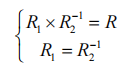

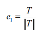

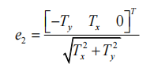

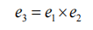

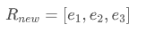

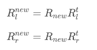

- *P1、P2*

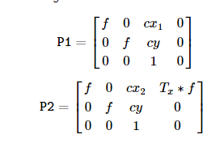

- *Q*

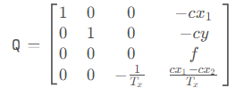

```cpp
int MxtStereoRectify(const cv::Mat& cameraMatrix1, const cv::Mat& distCoeffs1, const cv::Mat& cameraMatrix2, const cv::Mat& distCoeffs2,
                     const cv::Size& imageSize, const cv::Mat& R, const cv::Mat& T,
                     cv::Mat& R1, cv::Mat& R2, cv::Mat& P1, cv::Mat& P2, cv::Mat& Q)
{
    if (R.empty() || T.empty())
        return MT_INPUT_ERR;

    /*r1 r2*/
    cv::Mat R_vec;
    cv::Rodrigues(R, R_vec);
    cv::Mat r1, r2 = R_vec * (-0.5);
    cv::Rodrigues(r2, r2);
    r1 = r2.inv();

    /*Rrect*/
    cv::Mat e1 = r2 * T;//极线在共面时的T
    double e1n = cv::norm(e1);

    int dir = fabs(e1.ptr<double>(0)[0]) > fabs(e1.ptr<double>(0)[1]) ? 0 : 1;//极线方向（x y）
    double c = e1.ptr<double>(0)[dir];

    cv::Mat e2 = (cv::Mat_<double>(3, 1) << 0, 0, 0);
    e2.ptr<double>(0)[dir] = c > 0 ? 1 : -1;

    cv::Mat e3 = e1.cross(e2);
    double e3n = cv::norm(e3);
    e3 *= acos(fabs(c) / e1n) / e3n;

    cv::Mat Rrect;
    cv::Rodrigues(e3, Rrect);

    /*R1 R2*/
    R1 = Rrect * r1;
    R2 = Rrect * r2;

    /*f*/
    double fc_new = (cameraMatrix1.ptr<double>(dir ^ 1)[dir ^ 1] + cameraMatrix2.ptr<double>(dir ^ 1)[dir ^ 1]) * 0.5;

    /*cx cy*/
    cv::Point2d cc_new[2] = {};
    for (size_t k = 0; k < 2; k++)
    {
        /*图像四个顶点*/
        cv::Mat pts = cv::Mat::zeros(1, 4, CV_64FC2);
        for (size_t i = 0; i < 4; i++)
        {
            int j = (i < 2) ? 0 : 1;
            pts.ptr<cv::Vec2d>(0)[i][0] = (double)((i % 2)*(imageSize.width - 1));
            pts.ptr<cv::Vec2d>(0)[i][1] = (double)(j*(imageSize.height - 1));
        }

        /*基于内参畸变计算3d位置*/
        cv::Mat A = k == 0 ? cameraMatrix1 : cameraMatrix2;
        cv::Mat Dk = k == 0 ? distCoeffs1 : distCoeffs2;
        cv::undistortPoints(pts, pts, A, Dk);
        cv::Mat pts_3 = cv::Mat::zeros(1, 4, CV_64FC3);
        cv::convertPointsToHomogeneous(pts, pts_3);

        /*构建无畸变，标准内参，映射回图像坐标系，及其中心*/
        cv::Mat Z = cv::Mat::zeros(3, 1, CV_64FC1);
        cv::Mat A_tmp = cv::Mat::zeros(3, 3, CV_64F);
        A_tmp.ptr<double>(0)[0] = fc_new;
        A_tmp.ptr<double>(1)[1] = fc_new;

        cv::Mat dk = cv::Mat::zeros(1, 5, CV_64FC1);
        cv::projectPoints(pts_3, k == 0 ? R1 : R2, Z, A_tmp, dk, pts);
        cv::Scalar avg = cv::mean(pts);

        /*计算像素坐标系中心*/
        cc_new[k].x = (imageSize.width - 1) *0.5 - avg.val[0];
        cc_new[k].y = (imageSize.height - 1) *0.5 - avg.val[1];
    }
    cv::Point2d cx_avg;
    cx_avg.x = (cc_new[0].x + cc_new[1].x)*0.5;
    cx_avg.y = (cc_new[0].y + cc_new[1].y)*0.5;

    /*P1*/
    P1 = cv::Mat::zeros(3, 4, CV_64FC1);
    P1.ptr<double>(0)[0] = fc_new;
    P1.ptr<double>(0)[2] = cx_avg.x;
    P1.ptr<double>(1)[1] = fc_new;
    P1.ptr<double>(1)[2] = cx_avg.y;
    P1.ptr<double>(2)[2] = 1;

    /*P2*/
    P2 = cv::Mat::zeros(3, 4, CV_64FC1);
    P2.ptr<double>(0)[0] = fc_new;
    P2.ptr<double>(0)[2] = cx_avg.x;
    P2.ptr<double>(1)[1] = fc_new;
    P2.ptr<double>(1)[2] = cx_avg.y;
    P2.ptr<double>(2)[2] = 1;
    P2.ptr<double>(dir)[3] = e1.ptr<double>(0)[dir] * fc_new; // baseline * focal length

    /*Q*/
    Q = (cv::Mat_<double>(4, 4) <<
         1, 0, 0, -cx_avg.x,
         0, 1, 0, -cx_avg.y,
         0, 0, 0, fc_new,
         0, 0, -1.0 / e1.ptr<double>(0)[dir], (dir == 0 ? cx_avg.x - cx_avg.x : cx_avg.y - cx_avg.y) / e1.ptr<double>(0)[dir]);
    return MT_OK;
}
```

##### 5. 根据校正结果生成图像映射（MxtInitUndistortRectifyMap）

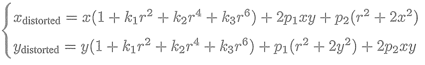

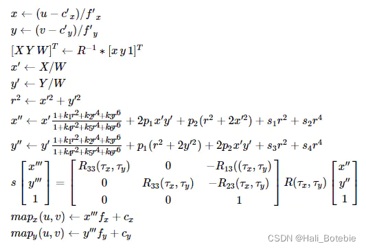

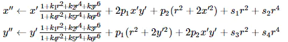


```cpp
int MxtInitUndistortRectifyMap(const cv::Mat& cameraMatrix, const cv::Mat& distCoeffs,
                               const cv::Mat& matR, const cv::Mat& matP, const cv::Size& size,
                               cv::Mat& mapX, cv::Mat& mapY)
{
    if (cameraMatrix.empty() || distCoeffs.empty() || matR.empty() || matP.empty() || size.empty())
        return MT_INPUT_ERR;

    /*mapX、mapY表示结果像素位置到原始数据mapX、mapY位置取像素 */
    mapX = cv::Mat::zeros(size, CV_32FC1);
    mapY = cv::Mat::zeros(size, CV_32FC1);

    /*摄像机坐标系第四列参数  旋转向量转为旋转矩阵*/
    cv::Mat iR = (matP.colRange(0, 3)*matR).inv();

    /*获取相机的内参 u0  v0 为主坐标点   fx fy 为焦距*/
    double u0 = cameraMatrix.at<double>(0, 2);
    double v0 = cameraMatrix.at<double>(1, 2);
    double fx = cameraMatrix.at<double>(0, 0);
    double fy = cameraMatrix.at<double>(1, 1);

    /*畸变参数*/
    double k1 = distCoeffs.ptr<double>(0)[0];
    double k2 = distCoeffs.ptr<double>(0)[1];
    double p1 = distCoeffs.ptr<double>(0)[2];
    double p2 = distCoeffs.ptr<double>(0)[3];
    double k3 = distCoeffs.cols + distCoeffs.rows - 1 >= 5 ? distCoeffs.ptr<double>(0)[4] : 0.;
    double k4 = distCoeffs.cols + distCoeffs.rows - 1 >= 8 ? distCoeffs.ptr<double>(0)[5] : 0.;
    double k5 = distCoeffs.cols + distCoeffs.rows - 1 >= 8 ? distCoeffs.ptr<double>(0)[6] : 0.;
    double k6 = distCoeffs.cols + distCoeffs.rows - 1 >= 8 ? distCoeffs.ptr<double>(0)[7] : 0.;

    /*映射*/
    for (size_t v1 = 0; v1 < size.height; v1++)
    {
        for (size_t u1 = 0; u1 < size.width; u1++)
        {
            cv::Mat uv = (cv::Mat_<double>(3, 1) << u1, v1, 1);
            cv::Mat xy = iR * uv;
            xy /= xy.ptr<double>(0)[2];
            double x = xy.ptr<double>(0)[0];
            double y = xy.ptr<double>(0)[1];
            double x2 = x * x, y2 = y * y, r2 = x2 + y2, _2xy = 2 * x*y;
            double xNew = x * (1 + ((k3*r2 + k2)*r2 + k1)*r2) / (1 + ((k6*r2 + k5)*r2 + k4)*r2) + p1 * _2xy + p2 * (r2 + 2 * x2);//k+p
            double yNew = y * (1 + ((k3*r2 + k2)*r2 + k1)*r2) / (1 + ((k6*r2 + k5)*r2 + k4)*r2) + p1 * (r2 + 2 * y2) + p2 * _2xy;//k+p
            double u2 = fx * xNew + u0;
            double v2 = fy * yNew + v0;
            mapX.ptr<float>(v1)[u1] = (float)u2;
            mapY.ptr<float>(v1)[u1] = (float)v2;
        }
    }

    return MT_OK;
}
```

<a id="stereo-computation"></a>

### 4. 双目计算

#### 1. 图像映射（cv::remap）

```cpp
cv::Mat imgsLeftOut, imgsRightOut;
cv::remap(imgsLeft[0], imgsLeftOut, calibResult.map1x, calibResult.map1y, 0);
cv::remap(imgsRight[0], imgsRightOut, calibResult.map2x, calibResult.map2y, 0);
cv::Mat merge;
cv::hconcat(imgsLeftOut, imgsRightOut, merge);
```

#### 2. 计算视差

- **OpenCV**

```cpp
cv::Ptr<cv::StereoBM> bm = cv::StereoBM::create(16, 9);
cv::Ptr<cv::StereoSGBM> sgbm = cv::StereoSGBM::create(0, 16, 3);
bm->setPreFilterCap(31);
bm->setBlockSize(15);
bm->setMinDisparity(0);
bm->setNumDisparities(80);
bm->setTextureThreshold(10);
bm->setUniquenessRatio(15);
bm->setSpeckleWindowSize(100);
bm->setSpeckleRange(32);
bm->setDisp12MaxDiff(-1);
cv::Mat disp, disp8;
bm->compute(imgsLeftOut, imgsRightOut, disp);
cv::Mat floatDisp, xyz, ppp;
disp.convertTo(floatDisp, CV_32F, 1.0 / 16.0);
```

- **自行实现**

  特征点匹配，代码各异

#### 3. 视差转 3D（MtxReprojectImageTo3D）

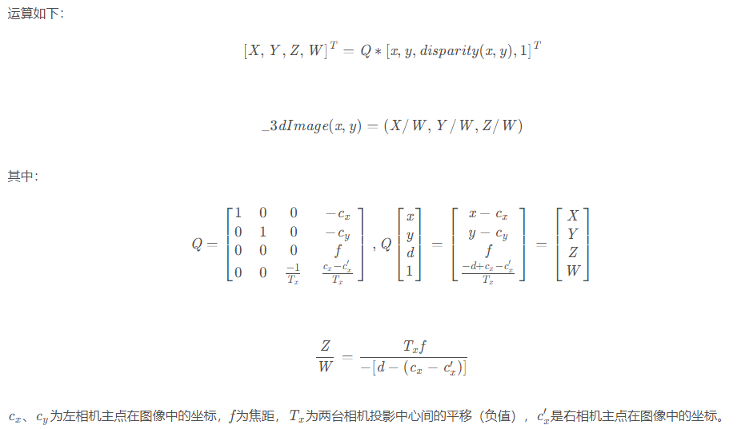

- **OpenCV**

```cpp
cv::reprojectImageTo3D(floatDisp, xyz, calibResult[4], true);
```

- **自行实现**

```cpp
MtxReprojectImageTo3D(floatDisp, calibResult[4], xyz);
```

```cpp
int MtxReprojectImageTo3D(const cv::Mat& disparity, const cv::Mat& Q, cv::Mat& result3d)
{
    if (disparity.empty() || Q.empty())
        return MT_INPUT_ERR;
    result3d = cv::Mat::zeros(disparity.size(), CV_32FC3);
    /*
	Q=[	1	0	0		-Cx			]*[	x	]=[	x-Cx	]		=[	X	]
		0	1	0		-Cy				y		y-Cy				Y
		0	0	0		f				dis		f					Z
		0	0	-1/Tx	(Cx-C'x)/Tx		1		(-d+Cx-C'x)/Tx		W
	*/
    for (size_t i = 0; i < disparity.rows; i++)
    {
        for (size_t j = 0; j < disparity.cols; j++)
        {
            if (disparity.ptr<float>(i)[j] == -1)
                continue;
            cv::Mat uvd = (cv::Mat_<double>(4, 1) << j, i, disparity.ptr<float>(i)[j], 1);
            cv::Mat res = Q * uvd;
            result3d.ptr<cv::Vec3f>(i)[j] = cv::Vec3f(res.ptr<double>(0)[0], res.ptr<double>(0)[1], res.ptr<double>(0)[2]) / res.ptr<double>(0)[3];
        }
    }
    return MT_OK;
}
```

<a id="references"></a>

## 参考资料

- [A Flexible New Technique for Camera Calibration](A%20Flexible%20New%20Technique%20for%20Camera%20Calibration.pdf)
- [ftdlyc/libcalib](https://github.com/ftdlyc/libcalib)

<a id="history"></a>

## 更新记录

| 时间 | 更新人 | 备注 |
| --- | --- | --- |
| 2023-10-17 | xsr | 创建 |
| 2023-11 | xsr | 单目部分，OpenCV 与自写代码结果保持一致 |
| 2023-12-14 | xsr | 双目部分完善，OpenCV 与自写代码结果保持一致 |
